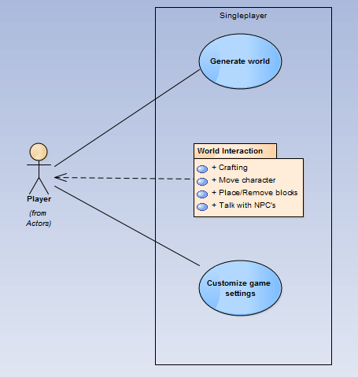
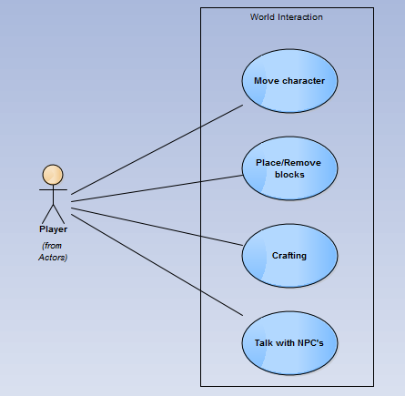

# Relatório 2 - ESOF
## Terasology - Requirements Management

###Elicitation and analysis

New requirements are suggested by everyone who wants to, through the [suggestions forum](http://forum.terasology.org/forum/suggestions.21/). From there, the original author of the suggestion (or someone else, provided they are interested in the suggestion), specifying what needs to be done in order to accomplish that requirement. After that, the topic is moved to the [modules forum](http://forum.terasology.org/forum/modules.55/), integrating it in a new module (or in one of the already existing modules). These modules are in independent repositories. When the code is implemented, tested, and working, it is merged into the repository of the module (without resorting to a pull request). A list of these modules (to which they refer as the Omega Distribution) can be seen [here](https://github.com/MovingBlocks/Terasology/blob/develop/README.markdown#modules).

In case the new requirement belongs to the game's core, the process is slightly different, mainly due to the fact that there are much more contributors involved in this part of the project. The sugestor starts by forking the project, and when he is finished coding the requirement, a pull request is issued. This method makes it possible for all the contributors to work on their part, without compromising the others' work and without the need to be constantly merging conflicts.

###Requirements
After the requirements' elicitation, these can be provided in a model similar to the one found here. The following diagram shows the mais requirements that define Terasology.

####Use cases

In order to clearly understand what an application is capable of doing and the requirements that may be deemed applicable, use cases should be listed.
The following diagrams reveal the most important use cases of Terasology.

This use case diagram allows us to visualize the 3 user roles on this software: player, host and client.

 

As a singleplayer, these are some of the expected actions to be available to the player. These use cases can be grouped as needed, like it's pictured on these models for
the "World Interaction" use case.

Like depicted on this diagram, the host must be able to setup a game server so that the clients can connect to it and interact with each other.

###Specification

In this phase, some documentation like a SRS document should be produced in order to specify the requisites to be fulfilled. On a volunteer, suggestion-based project like Terasology, such documentation is hard to create due to the fact that the contributors are in constant change and there is no specific documentation model to be followed by the collaborators when creating new features.
In our opinion, a documentation model for each feature would be a good asset because it would provide a solid reference not only for developing a document like the SRS document, but also for testing purposes.

### Validation

As previously stated, the game development is split into several modules, each of them having an independent repository. Every few weeks, the main developer, [Cervator](https://github.com/Cervator), will go through the modules, tests them, and adds them to the main repository and, consequentely, to the next release. If it was added to the game's core (which is in the main repository), he will test and eventually accept the pull request.
Eventually, a new release will be made. Being an open-source project, with volunteers as contributors, it is difficult to get new releases in stable periods of time. However, they try to do it every 2-4 weeks. 
They chose to follow the [Semantic Versioning](http://semver.org/) norm to name their releases. It works as follows:

Given a version number MAJOR.MINOR.PATCH, increment the:

- MAJOR version when you make incompatible API changes,
- MINOR version when you add functionality in a backwards-compatible manner, and
- PATCH version when you make backwards-compatible bug fixes.
Additional labels for pre-release and build metadata are available as extensions to the MAJOR.MINOR.PATCH format.

However, while on pre-alpha, the team is diverging from this model as described in [this page](https://github.com/MovingBlocks/Terasology/wiki/Versioning-Guideline). While MAJOR is 0, an increment on MINOR indicates an API incompatibility and
an increment on PATCH represents and additional functionality or bug-fix. For each MINOR increment there can also be more than one API breaking change.
