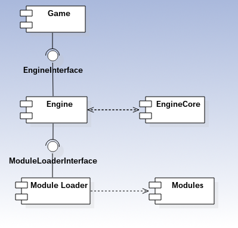
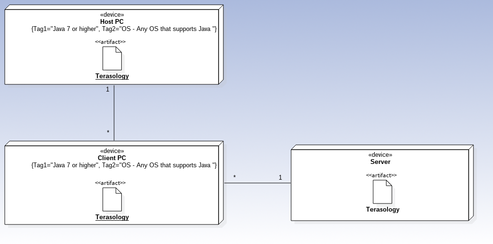
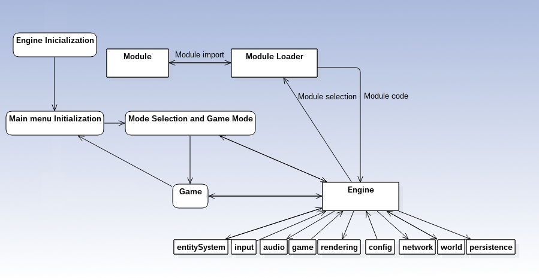

#Software Architecture

## Introduction

The aim of this report is to describe some aspects regarding Terasology's software architecture, following the 4+1 view model.

Said model is split into four views, the logical view (accompanied by a package diagram), the implementation view (accompanied by a component diagram), the deployment view (accompanied by a homonymous diagram) and, last but not least, the process view (accompanied by an analysis diagram).

All these views are linked through the use case view (the +1), whose diagram was developed in the last report.

## Logical View 

The logical view mainly focuses on the functional requirements and what the system (in another words, Terasology as a whole) should provide to its users. With this in mind, the system is decomposed in several abstractions and depicted as packages. The following package diagram describes this decomposition:

  

#### Interpretation

Terasology can be divided in 12 packages, 4 of them being used by the engine package, which is the package responsible for the game cycle. The rendering package renders the scene according to the current game state, the network package allows players to connect to servers on the network, the persistence package provides means to save the game state and restore it on future use and finally, the audio package handles the game's audio.

During game execution, information flows between the packages. Again, most of the information flows to, or from the engine package. The player input information is sent to the engine package, which is then used to, for instance, send the appropriate information to the world package, modifying the game world. The game world information is then sent back to the engine package, being used in updating the game cycle. The configurations selected by the user are also sent during game execution, since they can be changed during runtime. For instance, some of these configurations involve changing some of the algorithms used in rendering the world, so this flow of information is mandatory. The entities in the game (like NPCs) are also constantly changing their attributes (position, for instance). Therefore, information flow is also necessary between this package and the engine.

The game logic (which depends on the physics package) deal with the game logic and are used by the world and entitySystem packages, for example, for calculating gravity effect on the world and entities' elements.

In our opinion, this approach is a correct one because each functionality is independent from the others, which means that each can be worked on easily without compromising the other packages.

## Implementation View

The implementation view (also known as development view) focuses on decomposing software into components (program libraries, or subsystems) that are then developed by a small number of developers. These components are split into a hierarchy of layers, with the higher layers depending from the lower layers. The following component diagram depicts Terasology's layer hierarchy and dependencies:

#### Interpretation

The game interacts with the engine through an interface made available by the engine. The engine deals with everything else. The user, in the game settings, defines which modules they want to be loaded. After that, the engine asks the module loader for those modules, using an interface made available by the module loader. Each of these modules contains a feature, meaning that any features that are added to the game do not put in danger the program functionality. The module loader then makes those modules available to the engine, then being those modules passed by the engine to the game.

During the game, the engine communicates with its core to send to the game component the information regarding the world, entities, configurations, audio, etc.

In our opinion, this is an optimal approach since, as said, new modules can be added without compromising the entire system. This approach also allows each part of the system to be easily improved.

## Deployment View

The deployment view (also know as the physical view) takes into account more hardware-related requirements of the system, such as availability, reliabilty, performance and scalability. The development view is concerned not only with the computational resources (depicted as nodes) and the connections between them, but also with the manifestation of said computational resources, in the form of artifacts. The following deployment diagram shows these connections regarding Terasology:

#### Interpretation

Terasology is a computer game, which means that a PC is required in order to play the game. Being developed in Java, it requires either the Java Runtime Environment or the Java Development Kit, more specifically, version 1.7 or higher. Regarding the OS, any operative system that can run Java 7 or higher is sufficient to play the game. A list of the OS's that run Java can be found [here](https://blogs.oracle.com/henrik/entry/supported_platforms_for_jdk_7).

Terasology supports multiplayer. This is supported through two ways: Through a local server or through a dedicated server. A local server is a server hosted by one of the players, and the others can connect through LAN to the local server. A dedicated server is a device exlusively dedicated to hosting the server, to which the other players connect through the Internet.  

## Process View

The process view, acts as a linking bridge between the development and logical views. It takes into account requirements such as availability and performance, adressing issues such as the system's integrity and fault tolerance, and tries to fit the logical view's main abstractions into those requirements. The process view depicts this in a sequential manner, describing the system from the beggining of its execution to the end.

#### Interpretation

The game starts by initializing its engine, which will be held responsible for communicating with all the game components, like the audio, network and the game entities. After the engine is initialized, the game initializes the main menu GUI, in which the user will select the game mode he wants to play and modules he wants the use (among other things, like changing the settings or quitting the game). These modules are also requested by the engine to the module loader, which will then import the selected ones and send their code to the engine.

With all the required steps done, the game will start. The engine will take control of the game cycle, receiving information from the components, and sending them to the game, with which the user will interact. From the game, one can return to the main menu (and restart the cycle) or leave the game, ending the process. 

## Conclusion

The architectural approach taken by the Terasology developers is correct, since it allows them to easily add new features and modify existing ones without compromising the whole system. The information provided deemed enough in order to create the diagrams, and studying Terasology helped us consolidate and enlarge our knowledge regarding the 4+1 view model.