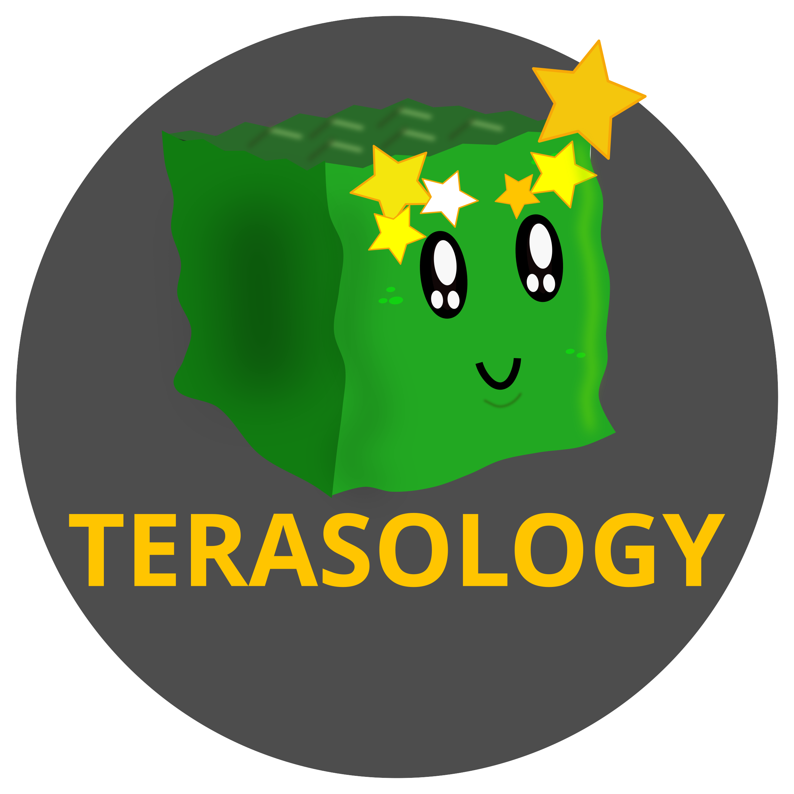

</>

    
    
    
    
    
     

<h3 align="center"><b>
    <a href="#community">Community</a> | 
    <a href="#installation">Installation</a> | 
    <a href="#development">Development</a>  | 
    <a href="#license">License</a> |
    <a href="https://terasology.org/Terasology/#/">Knowledge Base</a>
</b></h3>

The _Terasology_ project was born from a Minecraft-inspired tech demo and is becoming a stable platform for various types of gameplay settings in a voxel world.
The [creators and maintainers](https://github.com/MovingBlocks/Terasology/graphs/contributors) are a diverse mix of software developers, designers, game testers, graphic artists, and musicians. We encourage others to join!
We encourage contributions from anybody and try to keep a warm and friendly community and maintain a [code of conduct](.github/CODE_OF_CONDUCT.md).

## Community

If you want to get in contact with the **Terasology** community and the whole **MovingBlocks** team, you can easily connect with us, share your ideas, report and solve problems.
We are present in nearly the complete round-up of social networks. Follow/friend us wherever you want, chat with us and tell the world.

&nbsp;

    
    &nbsp;&nbsp;&nbsp;&nbsp;
    
    &nbsp;&nbsp;&nbsp;&nbsp;
    
    &nbsp;&nbsp;&nbsp;&nbsp;
    
    &nbsp;&nbsp;&nbsp;&nbsp;
    
    &nbsp;&nbsp;&nbsp;&nbsp;
    
    &nbsp;&nbsp;&nbsp;&nbsp;
    

## Installation

<table>
    <tr>
        <td></td>
        <th>Minimum Requirements</th>
    </tr>
    <tr>
        <td>System (OS)</td>
        <td>Windows, MacOS, Linux (64 bit)</td>
    </tr>
    <tr>
        <td>Processor (CPU)</td>
        <td>dual-core CPU</td>
    </tr>
    <tr>
        <td>Memory (RAM)</td>
        <td>4 GB</td>
    </tr>
    <tr>
        <td>Graphics* (GPU)</td>
        <td style="vertical-align:top">
            Intel HD Graphics (Gen 7) 
            GeForce 8xxx series (or higher) or 
            Radeon HD 2000 series (or higher) 
            with OpenGL 3.3
        </td>
    </tr>
    <tr>
        <td>Storage (HDD)</td>
        <td>1 GB</td>
    </tr>
</table>

\* _Please note, that if you have both integrated (chip) and dedicated (card) graphics, you should make sure that you're actually using your dedicated graphics when running Terasology._

Internet connectivity is required for downloading Terasology via the Launcher, afterwards playing offline is possible.

For easy game setup (recommended) you can use our launcher - [download it here](https://terasology.org/downloads/).

For more information about playing, like hot keys or server hosting, see the [dedicated page](docs/Playing.md) or check out the [modules](docs/Modules.md).

### Alternative Installation Methods

If you already have a Java Development Kit (JDK) installed, you may use a direct download release as an alternative to using the [launcher](https://github.com/MovingBlocks/TerasologyLauncher/releases). Java version 17 is required.

ßDirect download stable builds are uploaded to [our release section here on GitHub](https://github.com/MovingBlocks/Terasology/releases) while the cutting-edge develop version can be downloaded direct [here from our Jenkins](https://jenkins.terasology.io/job/Terasology/job/Omega/job/develop/lastSuccessfulBuild/artifact/distros/omega/build/distributions/TerasologyOmega.zip).

## Development

Development is possible on all common platforms (Windows, Linux, MacOS) as long as the JDK is properly set up.

### Requirements

Technical Requirements:
- Java SE Development Kit (JDK) 17. The CI will verify against this baseline version.
   Using newer Java versions may cause issues (see [#3976](https://github.com/MovingBlocks/Terasology/issues/3976)).
- Git to clone the repo and commit changes.

Non-Technical Requirements:
- familiarity with Git. Have a look at https://learngitbranching.js.org/ if you're not familiar with Git yet.
- familiarity with GitHub, _especially forks_. Have a look at [GitHub's "Working with Forks" Guide](https://docs.github.com/en/pull-requests/collaborating-with-pull-requests/working-with-forks) if you don't know how to work with forks yet.

### Workspace Setup

To be able to run **Terasology** from source, you'll need to setup your workspace.
Follow the [Contributor Quick Start Guide](https://terasology.org/Terasology/#/Contributor-Quick-Start).
This guide is designed for [IntelliJ IDEA](https://www.jetbrains.com/idea/) (you can use the free community edition), but alternative setups are possible.

> :warning: _Note, that a Terasology workspace is a **multi-repo workspace**._

While your workspace itself is a clone of [MovingBlocks/Terasology](https://github.com/MovingBlocks/Terasology), every subdirectory in your workspace directory `./modules/` is a clone of a [Terasology module repo](https://github.com/Terasology).

Accordingly, if you want to contribute to modules, you'll need to navigate into the respective subdirectory and work with Git from in there.
Any Git commands executed in your workspace root will target [MovingBlocks/Terasology](https://github.com/MovingBlocks/Terasology).

For more information, see our wiki entry on [Understanding Terasology's Git Setup](https://terasology.org/Terasology/#/Developing-Modules?id=understanding-terasology39s-git-setup).

### Contributing

Detailed information on how to contribute can be found in [CONTRIBUTING.md](.github/CONTRIBUTING.md). Remember, that all submissions must be licensed under [Apache License, Version 2.0](https://www.apache.org/licenses/LICENSE-2.0).

Terasology has a rather steep learning curve in the beginning.
To help you with the learning process, our [Terasology Knowledge Base](https://terasology.org/Terasology/#/), formerly known as the Terasology Engine wiki, helps you find the resources you need according to the field of contribution you're interested in.
Additional learning resources can be found in our [tutorial modules](https://github.com/Terasology?q=Tutorial&type=all&language=&sort=).

If you find errors or issues in any of our resources, please report them using GitHub issues and help fix them.

For developers that have not worked with complex software systems or dealt with the intricacies of Java yet, we recommend to start with [Good First Issues in Module Land](https://github.com/search?l=&q=org%3ATerasology+label%3A%22Good+First+Issue%22+state%3Aopen&state=open&type=Issues).

Developers with previous experience in rendering, physics and other less trivial aspects of game development are welcome to give the [Good First Issues in Engine](https://github.com/MovingBlocks/Terasology/issues?q=is%3Aissue+is%3Aopen+sort%3Aupdated-desc+label%3A%22Good+First+Issue%22) a go.

## License

Terasology is fully open source and licensed [Apache License, Version 2.0](https://www.apache.org/licenses/LICENSE-2.0) for code and [Creative Commons Attribution License, Version 4.0](https://creativecommons.org/licenses/by/4.0/) for artwork (unless indicated otherwise - see credits for minor exceptions).

## 🌐 Web Resources & Interactive Index
- [CATEGORY POOL 3](https://enskillcrafts.pages.dev/category-pool-3.html)
- [CATEGORY RPG](https://studyquests.pages.dev/category-rpg.html)
- [FITNESS CLUB 3D](https://themindplaying.web.app/fitness-club-3d.html)
- [INDEX29](https://iskillquest.pages.dev/index29.html)
- [FOREST MATCH 4](https://themindzone.pages.dev/forest-match-4.html)
- [CATEGORY CRAFTING45](https://quizverses.github.io/category-crafting45.html)
- [MERGE TOWER HERO](https://thequizzone.pages.dev/merge-tower-hero.html)
- [CATEGORY CONTROLLER59](https://iskillquest.pages.dev/category-controller59.html)
- [COUNT MASTERS SUPERHERO](https://quizverses.pages.dev/count-masters-superhero.html)
- [BLOCKS BREAKER](https://studyquesthub.web.app/blocks-breaker.html)
- [CATEGORY SURVIVAL366](https://studyquesthub.web.app/category-survival366.html)
- [MATRIX TYPER](https://themindzone.pages.dev/matrix-typer.html)
- [MOTORCYCLE RACER ROAD MAYHEM](https://thelearnquesters.pages.dev/motorcycle-racer-road-mayhem.html)
- [COLOR RINGS BLOCK PUZZLE](https://thelearnquesters.pages.dev/color-rings-block-puzzle.html)
- [MERGE FLOW](https://quizverses-9d2f2.web.app/merge-flow.html)
- [ZINDEX](https://quizverses-9d2f2.web.app/zindex.html)
- [ARROW SURVIVAL 15 SECONDS](https://themindzone.pages.dev/arrow-survival-15-seconds.html)
- [CATEGORY CASUAL 5](https://iskillquest.pages.dev/category-casual-5.html)
- [LIGHT BULB PUZZLE](https://studyplaying.github.io/light-bulb-puzzle.html)
- [FOX COIN MATCH](https://thelearnquesters.pages.dev/fox-coin-match.html)
- [GRANNY HALLOWEEN HOUSE](https://thelearnquesters.pages.dev/granny-halloween-house.html)
- [CATEGORY TOWER DEFENSE 2](https://studyplayings.pages.dev/category-tower-defense-2.html)
- [TAXI DRIVER SIMULATOR](https://themindzone.pages.dev/taxi-driver-simulator.html)
- [VOID ORBIT](https://thelearnquesters.pages.dev/void-orbit.html)
- [TRADING GAMES PLAYTIME](https://studyquesthub.web.app/trading-games-playtime.html)
- [CATEGORY CASUAL 6](https://thelearnquesters.pages.dev/category-casual-6.html)
- [CATEGORY MOBILE2 095](https://quizverses-9d2f2.web.app/category-mobile2-095.html)
- [MAZE ESCAPE CRAFT MAN](https://learnquester.github.io/maze-escape-craft-man.html)
- [CROCODILO TRALALERO RUN](https://themindzone.pages.dev/crocodilo-tralalero-run.html)
- [MERMAIDS SPOT THE DIFFERENCES](https://thelearnquesters.pages.dev/mermaids-spot-the-differences.html)
- [CATEGORY POINT AND CLICK123](https://iskillquest.pages.dev/category-point-and-click123.html)
- [INDEX10](https://studyplayings.pages.dev/index10.html)
- [PEOPLE PLAYGROUND RAGDOLL BATTLE](https://learnquester.github.io/people-playground-ragdoll-battle.html)
- [CATEGORY FPS GAMES](https://learnquester.github.io/category-fps-games.html)
- [MAGIC PIANO MUSIC](https://thelearnquesters.pages.dev/magic-piano-music.html)
- [MANSION STORY MATCH](https://themindzone.pages.dev/mansion-story-match.html)
- [MEDIEVAL ARENA](https://theskillquest.pages.dev/medieval-arena.html)
- [STUMBLE GUYS](https://quizverses-9d2f2.web.app/stumble-guys.html)
- [BUBBLE SHOOTER FREE 3](https://studyplayings.web.app/bubble-shooter-free-3.html)
- [COLOR SCREW RESCUE PUZZLE](https://quizverses.github.io/color-screw-rescue-puzzle.html)
- [SHOTTING BALLS](https://thelearnquesters.pages.dev/shotting-balls.html)
- [WORLD WARS TANKS](https://thelearnquester.web.app/world-wars-tanks.html)
- [CATEGORY SKILL254](https://themindzone.pages.dev/category-skill254.html)
- [AUTHENTIC FOOTBALL](https://quizverses-9d2f2.web.app/authentic-football.html)
- [ZOMBIE SPACE EPISODE II](https://thelearnquesters.pages.dev/zombie-space-episode-ii.html)
- [NONOGRAM DAILY](https://studyplayings.web.app/nonogram-daily.html)
- [CATEGORY SPORTS](https://learnquester.pages.dev/category-sports.html)
- [JIGSORT PUZZLES](https://thelearnquesters.pages.dev/jigsort-puzzles.html)
- [BOMBER FRIENDS](https://thelearnquesters.pages.dev/bomber-friends.html)
- [CATEGORY SKILL256](https://learnquester.pages.dev/category-skill256.html)
- [ANTISTRESS SIMULATOR OF SEQUINS DIY](https://thelearnquesters.pages.dev/antistress-simulator-of-sequins-diy.html)
- [CYBER MONDAY](https://studyplayings.pages.dev/cyber-monday.html)
- [SNAP FIX](https://quizverses-9d2f2.web.app/snap-fix.html)
- [BATTLE TANKS FIRESTORM](https://thelearnquesters.pages.dev/battle-tanks-firestorm.html)
- [CATEGORY POOL17](https://thelearnquesters.pages.dev/category-pool17.html)
- [CONTAINER SORT PUZZLE](https://thelearnquesters.pages.dev/container-sort-puzzle.html)
- [CATEGORY PUZZLE 2](https://thelearnquester.web.app/category-puzzle-2.html)
- [WAVE ROAD 3D](https://studyquesthub.web.app/wave-road-3d.html)
- [CATEGORY LINKS](https://studyplayings.pages.dev/category-links.html)
- [MAD TRUCK](https://studyplayings.pages.dev/mad-truck.html)
- [BOLTS AND NUTS](https://thelearnquester.web.app/bolts-and-nuts.html)
- [CATEGORY STICKMAN175](https://themindzone.pages.dev/category-stickman175.html)
- [JUMP GIRL 3D](https://studyplayings.pages.dev/jump-girl-3d.html)
- [CATEGORY SIMULATION](https://thelearnquesters.pages.dev/category-simulation.html)
- [WORLD CUP 2026 SOCCER GAME](https://themindzone.pages.dev/world-cup-2026-soccer-game.html)
- [VSCO GIRL AESTHETIC](https://themindzone.pages.dev/vsco-girl-aesthetic.html)
- [SWORD RUN 3D](https://themindzone.pages.dev/sword-run-3d.html)
- [PARKING FURY 3D NIGHT CITY](https://studyplayings.pages.dev/parking-fury-3d-night-city.html)
- [HERO RAGDOLL FIGHTING](https://thelearnquesters.pages.dev/hero-ragdoll-fighting.html)
- [CATEGORY GAMES](https://studyplayings.pages.dev/category-games.html)
- [CAKE LINK MASTER](https://quizverses-9d2f2.web.app/cake-link-master.html)
- [MERGE HEROES TITANS](https://thelearnquesters.pages.dev/merge-heroes-titans.html)
- [CATEGORY MOUSE1 697](https://iskillquest.pages.dev/category-mouse1-697.html)
- [RETRO STREET FIGHTER](https://quizverses-9d2f2.web.app/retro-street-fighter.html)
- [DRIVE RACE CRASH](https://learnquesters.pages.dev/drive-race-crash.html)
- [CATEGORY AVOID295](https://iskillquest.pages.dev/category-avoid295.html)
- [FURRY KUNG FU](https://studyquesthub.web.app/furry-kung-fu.html)
- [JEWEL LEGEND QUEST](https://quizverses.github.io/jewel-legend-quest.html)
- [ESCAPE OR DIE TROLL DEVIL LEVELS](https://studyquesthub.web.app/escape-or-die-troll-devil-levels.html)
- [EQ TEST PUZZLE](https://themindzone.pages.dev/eq-test-puzzle.html)
- [CATEGORY AGILITY](https://iskillquest.pages.dev/category-agility.html)
- [CATEGORY ADVENTURE 3](https://iskillquest.pages.dev/category-adventure-3.html)
- [LAST WAR SURVIVAL](https://learnquester.pages.dev/last-war-survival.html)
- [SAVE THE BEAUTY](https://quizverses-9d2f2.web.app/save-the-beauty.html)
- [LION FAMILY SIM ONLINE](https://themindzone.pages.dev/lion-family-sim-online.html)
- [BUBILOONS](https://learnquester.github.io/bubiloons.html)
- [BFFS Y2K FASHION](https://quizverses-9d2f2.web.app/bffs-y2k-fashion.html)
- [CATEGORY ALIEN34](https://iskillquest.pages.dev/category-alien34.html)
- [IDLE PINBALL MERGE CLICKER](https://themindzone.pages.dev/idle-pinball-merge-clicker.html)
- [SNAKE GO ESCAPE PUZZLE](https://studyplayings.pages.dev/snake-go-escape-puzzle.html)
- [GODS MIXER](https://thelearnquesters.pages.dev/gods-mixer.html)
- [SPRUNKI FIND THE DIFFERENCES](https://themindzone.pages.dev/sprunki-find-the-differences.html)
- [BUBBLE SHOOTER WONDERS OF EGYPT](https://studyplayings.pages.dev/bubble-shooter-wonders-of-egypt.html)
- [MONSTER SCHOOL VS SIREN HEAD](https://quizverses-9d2f2.web.app/monster-school-vs-siren-head.html)
- [THE BIG HIT RUN](https://quizverses-9d2f2.web.app/the-big-hit-run.html)
- [PALM ISLAND SOLITAIRE](https://learnquester.github.io/palm-island-solitaire.html)
- [KNIT RESCUE](https://theskillquest.pages.dev/knit-rescue.html)
- [ANIMAL ROYAL](https://themindzone.pages.dev/animal-royal.html)
- [PIECE OF CAKE MERGE AND BAKE](https://themindzone.pages.dev/piece-of-cake-merge-and-bake.html)
- [MINEBLOCK OBBY](https://themindzone.pages.dev/mineblock-obby.html)
- [BRAINROT HOLE](https://thelearnquesters.pages.dev/brainrot-hole.html)
- [CATEGORY MOUSE1 707](https://studyplayings.pages.dev/category-mouse1-707.html)
- [STEALTH MASTER SNEAK CAT](https://theskillquest.pages.dev/stealth-master-sneak-cat.html)
- [CATEGORY BASKETBALL 2](https://learnquester.pages.dev/category-basketball-2.html)
- [TILE HEX WORLD RED VS BLUE](https://studyquesthub.web.app/tile-hex-world-red-vs-blue.html)
- [SEA LORDS](https://thelearnquesters.pages.dev/sea-lords.html)
- [CATEGORY TOWER DEFENSE 2](https://studyquesthub.web.app/category-tower-defense-2.html)
- [OCTOPUS INVASION](https://theskillquest.pages.dev/octopus-invasion.html)
- [CATEGORY TOWER DEFENSE 3](https://thelearnquesters.pages.dev/category-tower-defense-3.html)
- [PIRATES MATCH THE LOST TREASURE](https://thelearnquesters.pages.dev/pirates-match-the-lost-treasure.html)
- [ERASE THE EXTRA ELEMENT](https://learnquester.github.io/erase-the-extra-element.html)
- [PLANE CHASE](https://quizverses.github.io/plane-chase.html)
- [SMART DOTS RELOADED](https://thelearnquesters.pages.dev/smart-dots-reloaded.html)
- [CATEGORY MONSTER](https://thelearnquesters.pages.dev/category-monster.html)
- [TSUNAMI RACE](https://studyquesthub.web.app/tsunami-race.html)
- [TRI PEAKS EMERLAND SOLITAIRE](https://learnquesters.pages.dev/tri-peaks-emerland-solitaire.html)
- [SAVE BABY CAPYBARAS PULL PIN](https://thelearnquesters.pages.dev/save-baby-capybaras-pull-pin.html)
- [CATEGORY STRATEGY](https://studyplayings.pages.dev/category-strategy.html)
- [MONSTER IMPACT](https://studyquesthub.web.app/monster-impact.html)
- [CRAZYZOMBIES 3D](https://themindzone.pages.dev/crazyzombies-3d.html)
- [JUNGLE FURY MUTANT RHINO MAYHEM](https://quizverses-9d2f2.web.app/jungle-fury-mutant-rhino-mayhem.html)
- [REAL STREET FIGHTER 3D](https://theskillquest.pages.dev/real-street-fighter-3d.html)
- [ARROWS PUZZLE ESCAPE](https://themindzone.pages.dev/arrows-puzzle-escape.html)
- [DIRTY MONEY THE RICH GET RICH](https://quizverses-9d2f2.web.app/dirty-money-the-rich-get-rich.html)
- [BATTLE RACING STARS](https://learnquester.pages.dev/battle-racing-stars.html)
- [STICKMAN THE FLASH](https://studyquesthub.web.app/stickman-the-flash.html)
- [MEOW BLOCK COLOR COLLECT](https://studyplayings.pages.dev/meow-block-color-collect.html)
- [CATEGORY FASHION](https://learnquester.github.io/category-fashion.html)
- [THE TRENDY MERMAID](https://studyplayings.web.app/the-trendy-mermaid.html)
- [PET SALON](https://quizverses.github.io/pet-salon.html)
