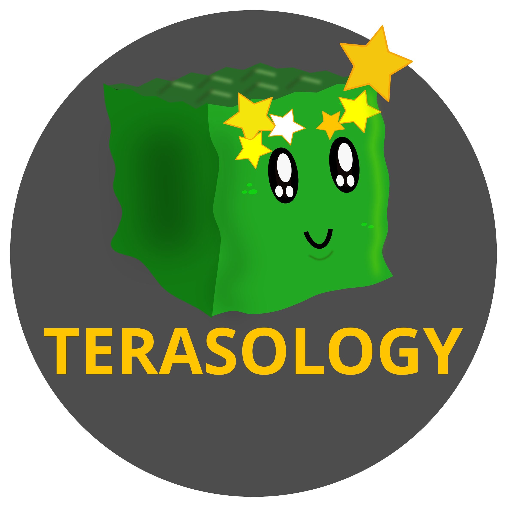

</>

    
    
    
    
    
     

<h3 align="center"><b>
    <a href="#community">社区</a> | 
    <a href="#installation">下载</a> | 
    <a href="#development">开发</a>  | 
    <a href="#license">协议</a> |
    <a href="https://terasology.org/Terasology/#/">知识库</a>
</b></h3>

_天工开物_ 项目, 是在一个从一个受我的世界影响的技术项目诞生的, 正在逐步的变成一个稳定的平台, 提供多元的玩法,在一个由方构成的世界中.   
[创造者和维护者](https://github.com/MovingBlocks/Terasology/graphs/contributors) 是由一群软件开发者, 设计师, 游戏测试员, 技术美术, 音乐家组成的. 我们期待着其他人的加入.  
我们期待着任何人的贡献, 并且尝试维护社区的热度与友好, 并遵循着[行为准则](.github/CODE_OF_CONDUCT.md)的领导.  

## 社区

如果你想要与 **天工开物** 社区和整个**MovingBlocks**团队接触, 你可以很容易的联系到我们, 分享你的主意, 汇报和解决遇到的Bug.  
我们出现在几乎所有的社交网络(But in China), 你可以在任何地方对我们进行 关注或添加好友, 和我们聊天,说任何事情.

&nbsp;

    
    &nbsp;&nbsp;&nbsp;&nbsp;
    
    &nbsp;&nbsp;&nbsp;&nbsp;
    
    &nbsp;&nbsp;&nbsp;&nbsp;
    
    &nbsp;&nbsp;&nbsp;&nbsp;
    
    &nbsp;&nbsp;&nbsp;&nbsp;
    
    &nbsp;&nbsp;&nbsp;&nbsp;
    

## 下载

<table>
    <tr>
        <td></td>
        <th>最低硬件需求</th>
    </tr>
    <tr>
        <td>系统 (OS)</td>
        <td>Windows, MacOS, Linux (64 bit)</td>
    </tr>
    <tr>
        <td>处理器 (CPU)</td>
        <td>双核CPU</td>
    </tr>
    <tr>
        <td>内存 (RAM)</td>
        <td>4 GB</td>
    </tr>
    <tr>
        <td>显卡* (GPU)</td>
        <td style="vertical-align:top">
            Intel HD Graphics (Gen 7) 
            GeForce 8xxx series (or higher) or 
            Radeon HD 2000 series (or higher) 
            with OpenGL 3.3
        </td>
    </tr>
    <tr>
        <td>存储 (HDD)</td>
        <td>1 GB</td>
    </tr>
</table>

\* _请注意, 如果你同时拥有独显和集显, 你应该确定一下,目前在用哪一个显卡运行天工开物._  

网络连接是必要的, 为了通过启动器来下载天工开物, 在那之后,你可以离线来进行游玩.  

简单的游戏安装(推荐)请使用我们的启动器 - [在这里下载](https://terasology.org/downloads/).

更多关于游玩的信息, 比如热键, 创造服务器, 请查看[详情页面](docs/Playing.md) 或者看看[模块](docs/Modules.md).

### 其他安装方法

如果你已经拥有 Java Development Kit (JDK) installed, 你可以直接在这里直接下载发行版, 作为使用[启动器](https://github.com/MovingBlocks/TerasologyLauncher/releases)的替代方法. Java version 17 是必须的.  

>应该是在上面,能够直接下载启动器, 下面可以直接下载游戏本体

ß直接下载稳定的构建版本[我们的稳定版在GitHub的这里](https://github.com/MovingBlocks/Terasology/releases) 而最新的开发版可以从这里下载到 [这里是Jenkins地址](https://jenkins.terasology.io/job/Terasology/job/Omega/job/develop/lastSuccessfulBuild/artifact/distros/omega/build/distributions/TerasologyOmega.zip).  

## 开发

你可以在任何通用平台上进行开发 (Windows, Linux, MacOS) 只要你正确的安装了JDK

### 要求

技术性要求:
- Java SE Development Kit (JDK) 17. CI 会根据此版本进行验证.
   使用更新的Java可能会造成这些问题 (see [#3976](https://github.com/MovingBlocks/Terasology/issues/3976)).
- Git 来克隆仓库和进行提交.

非技术性需求:
- 对git熟悉. 可以去菜鸟教程上看看这篇文章, 如果你对git不是很熟悉 https://www.runoob.com/git/git-tutorial.html
- 熟悉GitHub, _尤其是forks_. 点击这里看看[GitHub's "Working with Forks" Guide](https://docs.github.com/en/pull-requests/collaborating-with-pull-requests/working-with-forks) 如果你对forks不是很熟悉.

### 工作区设置

为了能够从源代码运行**天工开物**, 你需要设置好你的工作区.
按照[贡献者入门指南](https://terasology.org/Terasology/#/Contributor-Quick-Start).
这个指南是针对[IntelliJ IDEA](https://www.jetbrains.com/idea/) (你可以使用免费的社区版本), 但是不同的设置也是可以的,比如Eclipse.

> :warning: _提示, 天工开物工作区是一个**多仓库工作区**._

你的工作区是[MovingBlocks/Terasology](https://github.com/MovingBlocks/Terasology)的克隆, 但是每一个在`./modules/`的子目录是[Terasology module repo](https://github.com/Terasology)的克隆.

因此, 如果你想为模块做贡献, 你需要导航到对应的子目录并在那里使用Git.
在根目录使用的Git指令都是以[MovingBlocks/Terasology](https://github.com/MovingBlocks/Terasology)为目标的.

F有关更多信息，请参阅我们的wiki条目 [理解天工开物的Git设置](https://terasology.org/Terasology/#/Developing-Modules?id=understanding-terasology39s-git-setup).

### 贡献

关于如何贡献,请参考这篇文档 [贡献.md](.github/CONTRIBUTING.md). 注意,所有的提交都必须按照 [Apache License, Version 2.0](https://www.apache.org/licenses/LICENSE-2.0).

天工开物在一开始有着一个相当陡峭的学习曲线.
为了帮助您完成学习过程, 我们[天工开物知识库](https://terasology.org/Terasology/#/), 以前称为 天工开物引擎Wiki, 帮助你查找你需要的资源,根据你感兴趣的贡献领域.
更多的学习知识可以在这里学到[教程模块](https://github.com/Terasology?q=Tutorial&type=all&language=&sort=).

如果你找到任何问题在我们的资源中, 请使用Github issues来汇报,并帮助我们修复它们.

对那些还没有处理过复杂软件系统或者处理过复杂开发的Java开发者,我们推荐从这篇文章开始 [模块里的一个好的第一个Issue](https://github.com/search?l=&q=org%3ATerasology+label%3A%22Good+First+Issue%22+state%3Aopen&state=open&type=Issues).

对在渲染,物理或者其他游戏开发工作的开发者,可以看看这个[引擎里的一个好的第一个Issue](https://github.com/MovingBlocks/Terasology/issues?q=is%3Aissue+is%3Aopen+sort%3Aupdated-desc+label%3A%22Good+First+Issue%22) .

## License

天工开物是完全开源的  
代码遵循 [Apache License, Version 2.0](https://www.apache.org/licenses/LICENSE-2.0). 
美术遵循 [Creative Commons Attribution License, Version 4.0](https://creativecommons.org/licenses/by/4.0/). 
- (除非另有说明 - 参考特别谢明,来查找例外).
