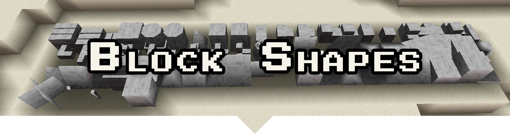
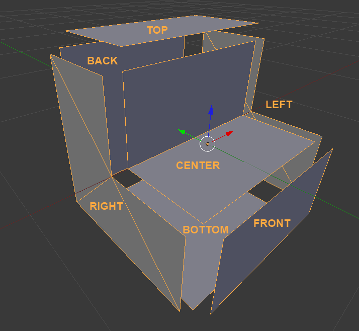
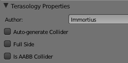

A block shape defines a way a block can look - its shape.
Each block shape can be used by multiple blocks, each applying a different texture to it.
Each shape is composed of _up to_ 7 parts:

- The **center mesh**, which is always rendered if present (visible). This is typically used for parts of the block contained _within_ the area of the block.
- Six **side meshes** - one for each direction. These are only rendered if the side is not obscured.

Additionally, each side is either a full side or a partial side.
A full side fills the entire side of the block, and thus obscures the sides of adjacent blocks.
A partial side does not.

Below is an example stair block shape, with each side moved away from the center.
In the stair block, the Back and Bottom sides are full sides, while the Top, Front, Left and Right sides are not.

## Shape part

Surrounds the shape definition.
Contains one or more Mesh Part blocks, which may be named Center, Top, Bottom, Left, Right, Front or Back.
These correspond to each of the direction, and the central mesh as follows:

<table>
    <tr>
        <td><b>Sub-block</b></td>
        <td><b>Direction</b></td>
    </tr>
    <tr>
        <td>Center</td>
        <td>-</td>
    </tr>
    <tr>
        <td>Top</td>
        <td>+Y axis</td>
    </tr>
    <tr>
        <td>Bottom</td>
        <td>-Y axis</td>
    </tr>
    <tr>
        <td>Front</td>
        <td>-Z axis</td>
    </tr>
    <tr>
        <td>Back</td>
        <td>+Z axis</td>
    </tr>
    <tr>
        <td>Left</td>
        <td>-X axis</td>
    </tr>
    <tr>
        <td>Right</td>
        <td>+X axis</td>
    </tr>
</table>

> ℹ️ A standard block is centered on the origin, with each side 0.5 units away in the appropriate direction.

Generally the front of the block is the side you expect to face towards the player when they are placing it, e.g., the front of stairs such that you can walk upwards.
Additionally a Shape may contain a [Colliders](#colliders) section, if it wishes to have a collision shape other than the full block.
Stairs, for instance, have two colliders - one for the bottom step and one for the top.

## Mesh Part

Each mesh part block contains the following components:

- **vertices** - a list of 3D vectors that make up the mesh part
- **normals** - a list of normals corresponding to the vertices
- **texCoords** - the texture coordinates corresponding to the vertices
- **faces** - one or more lists of indices corresponding to vertices, each of which forms a polygon that comprises the mesh part.
- **fullSide** - a boolean denoting whether a side obscures all adjacent sides or not - basically whether it is a square the fills that side of the cube. This isn't used by the center mesh part, and if not specified defaults to false.

## Colliders

The colliders section lists one or more Axis-Aligned Boxes that define collision for the shape.
Axis aligned means the sides of the box are always at right angles to the primary axes.

Each collider has two properties:

- **position** - where the collider is centered
- **extents** - how far away each corner of the box is along each axis.

## Block Shapes in Blender

Terasology has a easy-to-edit shape format for blocks allowing anyone, with a small amount of learning, to create new block shapes that can be easily used in the game.
While the block shape format _is_ hand editable and you _could_ write a block shape by hand, there is a great addon for the free, open source 3d editor Blender ([Blender's Home](https://www.blender.org)) that allows you to easily create block shapes in a visual WYSIWYG environment and export them for use in Terasology.

### Install the Block Shape Addon

- **Download Blender**. We recommend Blender 2.63 to be used (there is experimental support for Blender 2.8).
- **Download the shape plugin** from [MovingBlocks/BlenderAddon](https://github.com/MovingBlocks/BlenderAddon/releases).
  There are two zips that can be downloaded one is for the md5 exporter and the other shape exporter is used for exporting block shapes.

  > Note: sometimes the shape exporting addon can be buggy, if it does not import properly extract the zip and place it in the plugins folder.
  > The addon should be visible in the _Settings_ menu.

- _Optional:_ additional example shapes can be found [here](https://github.com/MovingBlocks/BlenderAddon/tree/master/examples/shapes)

### Fundamentals

A block shape in Blender is a set of mesh objects corresponding to the various parts of the block shape.
For each side and the center part of the block shape, a mesh object with the corresponding name can be present: Top, Bottom, Left, Right, Front, Back and Center.
Additionally, extra mesh objects can be used to define the collision bounds for the block shape.

When creating a block shape, you need to keep the following in mind:

- Blocks should be created centered on the origin
- A standard block is half the scale of a new Blender cube
- Blender axes are different from Terasology's axes, see [Shape Part](#shape-part).

### Terasology Exporter Addon Properties

The Terasology Block Shape addon adds two panes to the 3d view properties side panel in Blender (by default the shortcut is <kbd>N</kbd> while hovering over the 3D view window).

The first pane, Terasology Scene Properties, contains settings that are universal (not based on what mesh you have selected):

- Author - Your name here
- Collision Type
- Is Collision Symmetric - Is collection unchanged if the block is rotated? If checked, then definitions using this shape will not have a block generated for each rotation.
- Use Billboard Normals - For flat, vertical billboards, this causes the normals to point upwards so they are lit correctly by sunlight.

The second pane, Terasology Mesh Properties, contains settings that apply to the currently selected mesh object:

- Full Side - Does this side fill the block's space - this will cause the side of blocks facing it not to be rendered.
- Collider Type

Example properties screen (may be outdated):

### Tips & Tricks

- To avoid problems later in the creation process, scale in Edit Mode instead of Object Mode.
- When UV mapping, you should map against a single 16x16 texture.
- To preview your shapes texture after unwrapping, you can switch a 3d view in Blender to Textured shading.
  Additionally, having mipmapping turned off will give a display very similar to what you will see in-game.
  To disable mipmapping:
  - Go to the user preferences (File menu).
  - In the user preferences window, go to the 'System' tab.
  - In the middle near the top you should find a checked option that says 'Mipmaps'. Uncheck this.

### Related Links and Resources

- [Youtube series covering block shape creation in Blender](http://www.youtube.com/watch?v=BM219wj0v6Y)
