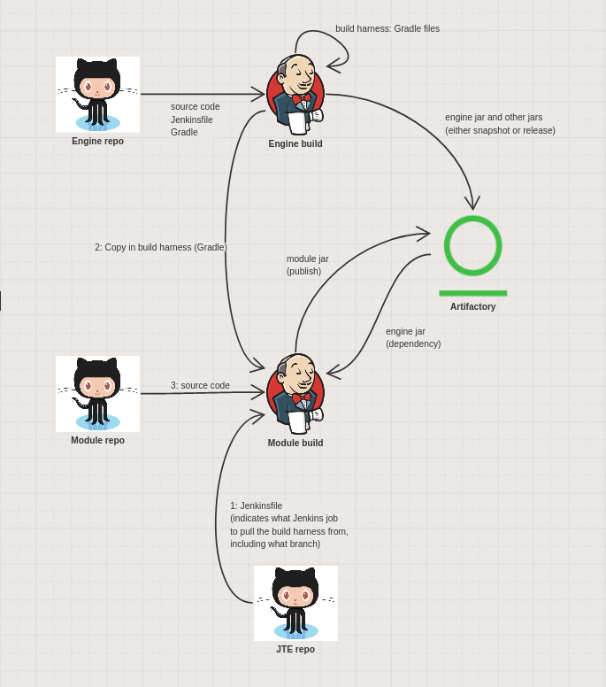

In Terasology, the engine as well as all libraries and modules are automatically built on [Jenkins](https://jenkins.terasology.io) and the resulting build artifacts published to our [Artifactory](http://artifactory.terasology.org).
While libraries and the engine define how they are built via a `Jenkinsfile` and `build.gradle` in their repositories, the modules in the [Terasology GitHub Org](https://github.com/Terasology) do not (yet).

## Local Module Builds

In a local setup, the [template for modules' `build.gradle`](https://github.com/MovingBlocks/Terasology/blob/develop/templates/build.gradle) located in the engine repo, is copied to the local source of the module(s) to be built.
If the should be deleted, corrupted or out-of-sync, it can be re-synchronized using `groovyw module refresh`.

## CI Module Builds

For the CI, the [`Jenkinsfile` in `ModuleJteConfig`](https://github.com/MovingBlocks/ModuleJteConfig/blob/develop/Jenkinsfile) defines how modules are built.
As modules normally need to be built while being embedded in a full engine workspaces, when being built in the CI, they are "on their own".
To enable building modules "standalone", the so called _build harness_ is copied into the build environment.

The build harness is a collection of files that are attached to engine jobs.
It provides the gradlew wrapper (`gradlew`) to execute the build, files defining the build logic, amongst others the `build.gradle` as well as additional files required for building modules such as the natives and config files for the analytics (code quality checks, etc.).
The build harness files are generated as part of the [engine job's build stage](https://github.com/MovingBlocks/Terasology/blob/develop/Jenkinsfile#L53-L61) and are copied into the build environment as part of the [build setup stage](https://github.com/MovingBlocks/ModuleJteConfig/blob/develop/Jenkinsfile#L36-L37).

