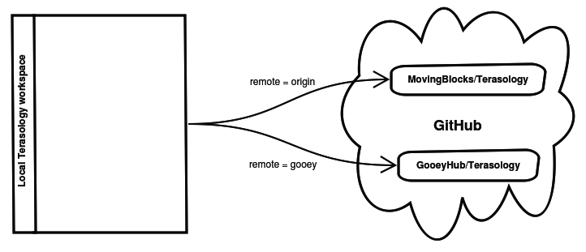

Alright, you have gone through [Contributor Quick Start](Contributor-Quick-Start.md) and maybe looked at [Developing Modules](Developing-Modules.md) - now how about actually submitting some changes back to GitHub?

There are two ways to submit changes back to GitHub, either gaining write ("push") access to any of our root repos or forking personal copies of any of them yourself.

The examples below are fairly light and expect some minimal knowledge of Git or ability to surf Google to learn. You may also consider native clients like [GitHub Desktop](https://desktop.github.com) if available to you.

There are plenty of [good Git tutorials on the web](http://learngitbranching.js.org) - this link goes to one of them.

## Creating a fork

To get your own personal copy of a repo on GitHub you simply click the "Fork" button at the main page of any repo. You'll have full rights on the resulting fork.

You can see how a root repo (in this case `MovingBlocks/Terasology`) and its forks relate by checking the network graph: https://github.com/MovingBlocks/Terasology/network

Each dot is a unique commit containing a change, each label is a branch, and each section beyond `MovingBlocks` is somebody's personal fork of Terasology's main project repo that contains unique changes.
 
If you made a commit in your fork of the Terasology repo it would show up as its own dot in your username's section. May have to refresh your browser once or twice if the change is recent :-)
 

## Getting direct write access 

While you can fork module repos we hand out write access to modules pretty easily. So long as you've made a good impression, proven yourself able to make changes with Git, and have an interest in working on a module not actively being worked by somebody else, you're in!

Multiple people can work directly on a single module repo if they coordinate well, but this is where it becomes useful to work via Pull Requests (PRs - see below)

To get access ask in our [forum](http://forum.terasology.org/forum) - be patient please :-)

Trusted long-term contributors can eventually get these rights to the main repos under the `MovingBlocks` organization on GitHub. 

## Updating a fork

After you make a fork you need to create a second remote reference in your local Git root. There are better guides to Git elsewhere, but in short:

* If you cloned `MovingBlocks/Terasology` then that will be your remote named `origin` but you won't (to begin with) have push rights to it. You add a second remote maybe named after your username, so our mascot would name it `gooey`, and push your changes there 
* If you cloned your fork then that will be your `origin` remote and you can add a second remote to `MovingBlocks/Terasology` - this you could name `movingblocks` or `upstream` and use to pull updates when changes are made there.

Naturally you can adjust that process for modules. The main difference there is that you first need to `cd modules/[name]` where `[name]` is the module to work with. This is so you're interacting with your nested Git root for the module rather than the Terasology root project. 

In the following diagram our mascot Gooey (GitHub username [GooeyHub](https://github.com/GooeyHub)) cloned `MovingBlocks/Terasology` first then made a remote named `gooey` to the fork using `git remote add gooey https://github.com/GooeyHub/Terasology`

When you have two remotes defined (and use `git fetch --all` or Fetch under Git options in an IDE) you can now pull and push code between your local workspace and GitHub. A regular workflow then goes like (assume `origin` is your fork and `upstream` is `MovingBlocks/Terasology`):

* Write some code
* Make a local commit in your develop branch 
  * If the change is at all substantial consider using a topic branch instead - see note below
* Push your local changes to your fork on GitHub: `git push origin develop`
* Make a PR (look below)
* Wait for it to be accepted, optionally submit more changes
* After the PR is merged and other changes have happened you update your local workspace with `git pull upstream develop`

**Note:** While this is easy and straight forward the concept of [topic branches](https://git-scm.com/book/en/v2/Git-Branching-Branching-Workflows) has become more popular over time and should ideally be used for each substantial change you make. Essentially you make a new branch per change, so you can switch back and forth as needed, keeping `develop` clean in case you want to test without your change or make more independent branches from it. This also lets you simply delete "spent" branches.

## Creating a pull request (PR)

When you have suitable changes to be submitted to somebody else's repo on GitHub from your fork you can issue a "Pull Request" to get their attention and review for your changes.
 
At your repo page, for instance https://github.com/GooeyHub/Terasology, you should see a summary comparing your selected branch to the matching branch in the repo you forked from, listing outstanding differences if any.

Simply click the "Pull Request" button to get started. Make sure your target (may be called "base fork") and source (may be called "head fork" - your fork) are correct and the changes are what you expect.

In your description please describe the changes you've made and how to test them, along with any particular review notes / justification for why you made the change, if needed. Submit the PR then please wait for project staff to review your request - could take a little while :-)

*Note:* While normally you would PR a change from one repo (like a fork) to another (like the root repo) nothing prevents you from using a PR inside a single repo to go from one branch to another. Some stay organized and review their code that way.