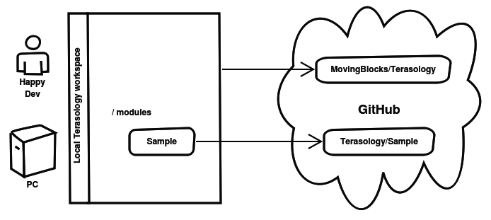

To work with modules you need to either fetch existing ones or create new ones. We have utility tasks in Groovy to make this process easier.

When working on modules there are two things that you can do

1. [Contribute to an existing Module](#contributing-to-existing-module)
2. [Create a new Module](#create-a-new-module)

## Contributing to existing module

Let us use the `Sample` module from https://github.com/Terasology/Sample for the examples below. In the root of your workspace execute:

`groovyw module get Sample`

(in a Linux(-like) terminal you'll need to use `./groovyw`)

Where `Sample` is the name of the module you want to contribute to. In the case of the `Sample` module Groovy will fetch the existing GitHub repo from https://github.com/Terasology/Sample and place it in your local workspace at `modules/Sample`

To properly adjust your workspace you need to let Gradle refresh, by clicking the little refresh icon in the Gradle tab of IntelliJ

After the refresh process finishes IntelliJ should notice the new module(s) - may take a moment or two

You may notice that additional files and directories were created in the `Sample` directory. This includes the `build.gradle` needed to build the module, along with placeholder folders for all asset types and such.

### To add a new feature or fix a bug 

Follow these steps:

- Create a fork of the module repo, or gain access to make branches in the module under the Terasology org
- Make sure your local workspace is up-to-date with the main repository by running `groovyw module update Sample` (or whichever module(s))
- Create a new branch to work on the new feature or bug via the updated branch `git checkout -b "branch_name"`
- Work on the feature/bug and stage all the files to commit it on that branch `git add .` > `git commit -m "Commit Message"`
- Push the branch to your fork `git push -u origin branch_name`
- Create a pull request.

For detailed explanation on dealing with forks checkout the [See also](#see-also) section

## Create a new module

For new modules there is an additional step or two. Start with a slightly different command:

`groovyw module create MySample`

This will create a module named "MySample" at `modules/MySample`

As with fetching a module be sure to let Gradle refresh your workspace after your module lineup has changed. 

You'll notice the new module directory has been created with some placeholder files. Adjust [module.txt](Module.txt.md) accordingly to describe your module.

To work on your new module make sure that - 

- Your local workspace is up-to-date with the main Terasology repository (even if you're working on a module).
- Create a new branch to work on the new feature or bug via the updated master branch `git checkout -b "branch_name"`
- Work on feature/bug and stage all the files to commit it on that branch `git add .` > `git commit -m "Commit Message"`
- Push the branch to your fork `git push -u origin branch_name`
- Create a pull request.

If you're working on a new gameplay template (as opposed to utility modules meant to be enabled alongside a different template) you'll need to add CoreRendering as a dependency, which can be done in the [module.txt](Module.txt.md) like this:

```json
{
    "id" : "MySample",
    "version" : "0.1.0-SNAPSHOT",
    "author" : "",
    "displayName" : "MySample",
    "description" : "",
    "dependencies" : [ { "id": "CoreRendering", "minVersion": "1.0.0" } ],
    "serverSideOnly" : false
}
```
 
Connecting your new module to a home on GitHub can be done in one of two ways, either of which needs you to create a new remote reference in the local Git repo.

* You can kindly ask project staff to create a module repo for you under the [Terasology organization on GitHub](https://github.com/Terasology) and give you access.
* You can create your own module repo on your personal GitHub account

After you have a module repo on Github, `cd` to `modules/MySample` and execute `git remote add origin https://github.com/[username]/MySample`

Where `[username]` is either your account name on GitHub for a personal repo or `Terasology` for official module repos. Fetch from and push to your new module home on GitHub and make some PRs!


## Understanding Terasology's Git setup

Having fetched or created a module you now have *two* Git repos in your local workspace.

* The root Terasology project containing the engine and everything else
* The module with its own nested Git root under `/modules/Sample` or so

This is known as having a nested Git project in your workspace. The nested Git root (the module) is excluded from tracking in the Git repo holding the main Terasology stuff.

All that means is that you treat the two pieces independently when it comes to source control. IntelliJ and other tools can handle this very easily. Here is a diagram to explain:



For more information, go to [Multi-Repo Workspace](Multi-Repo-Workspace.md).

## Structure of modules

This is just a sample listing of assets - there are more types. See our [asset tutorial](https://github.com/Terasology/TutorialAssetSystem/wiki) for more

* `/assets` - place resources related to the module under here and our  Asset System will find them. You can optionally introduce additional directory levels under each asset type to organize better (subdirs are ignored by the game engine, just a human convenience)
   * `/blocks` - block definitions go here, which are simple JSON files holding any special instructions related to each block (or nothing at all). Each block may reference one or more textures for its faces. See [Block System](Block-Definitions.md) for more details
   * `/blockTiles` - block textures go here and are usually matched by block definition files. However, if you place an `auto` directory under here any images there will automagically become basic blocks (same texture on all sides, no special traits)
   * `/prefabs` - these JSON files describe entity recipes that can be used by the game engine to create objects in-game. This could for instance be a Portal describing what it is able to spawn, or a chest block able to hold items. See [Entity system concepts](Entity-System-Architecture.md)
   * `/sounds` - another asset type example. You can place an audio file here in the OGG format and then reference it using the mod's namespace, such as `portals:spawn`
* `/src` - actual source code for custom functionality goes under here. Usually this will be custom Components and Systems that make up the core content in our [Entity System Architecture](Entity-System-Architecture.md)
   * `/ui` - ui-related classes such as HUD widgets or screens (see our [Nui Tutorial](https://github.com/Terasology/TutorialNui/wiki))
   * `/world` - world-related classes, for instance facets, providers, and rasterizers (see our [World Generation Tutorial](https://github.com/Terasology/TutorialWorldGeneration/wiki))
   * `/topicA` - place components, events, and systems related to a specific topic into the same sub-package - this allows for the classes to access each other's package-private members and methods
   * `/topicB` - try to cluster components, events, and systems based on the "thing" or "action" they represent, notify about, or manage

## Namespace

The typical namespace for a module is `org.terasology.module.<nameOfTheModule>`. It is recommended to name the source packages accordingly, otherwise the modules may not be built or loaded as expected.  

_See [#2445](https://github.com/MovingBlocks/Terasology/issues/2445) for more details._

## See also

* [Modding API](Modding-API.md) - the methods a module is allowed to call
* [Testing Modules](Testing-Modules.md) - test your module with unit tests and integration tests
* [Module Dependencies](Module-Dependencies.md) - how to deal with modules that depend on another
* [Dealing with Forks](Dealing-with-Forks.md) - work with your own copies of GitHub repos you can write to
