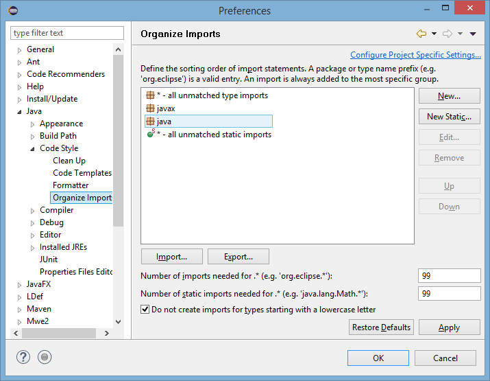

Eclipse can be used with Terasology just like IntelliJ, but needs a little more manual setup.

TODO: We have a few more files at `config/eclipse` that could use some setup instructions and/or automated customization like for IntelliJ.

### Note

All of the settings described below can be applied to a specific Eclipse project or to an entire workspace.

- To apply the settings on a per-project basis, right-click on a project in the Package Explorer and select _Properties_. (Alternatively, select the project and press Alt+Enter.) After navigating to a relevant section of the Preferences menu, check _Enable project-specific settings_. Repeat this for all the projects you'd like to work on.

- To apply the settings globally, select _Window → Preferences_ from the main menu and navigate to a relevant section.

### Formatting Convention Setup

- In _Java Code Style → Formatter_, click _Import_ and import Terasology's formatting settings file ([Terasology/config/eclipse/formatting.xml](https://github.com/MovingBlocks/Terasology/blob/develop/config/eclipse/formatting.xml)). The _Terasology formatting conventions_ profile should be automatically selected.

### Import Order Setup

- In _Java Code Style → Organize Imports_, click Import and import Terasology's import order file ([Terasology/config/eclipse/.importorder](https://github.com/MovingBlocks/Terasology/blob/develop/config/eclipse/.importorder)).

- **[Optional, but recommended]** Switch to _Window → Preferences → Editor → Save Actions_. Check _Perform the selected actions on save_ and _Organize imports_.

