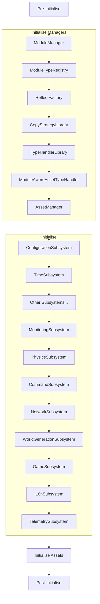
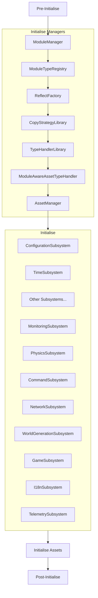

## Engine Start-Up

### Why three phases?
_These are just my guesses based on the provided documentation._
#### Pre-initialise
This phase allows for doing most of the initialisation for a subsystem that does not rely on other subsystems.
Any subsystem state that needs to be accessed from other subsystems should be initialised here.

#### Initialise
This is the first point at which subsystems have access to the module context. Most subsystems will properly initialise
themselves here. It also allows subsystems to interact in a limited fashion, although this shouldn't be often needed.

#### Post-initialise
This is the last point at which a subsystem should initialise itself. After this stage, the subsystem should be
considered fully initialised. If a subsystem must depend immediately on other initialised subsystems, interact
with them here. This occurs after engine assets have been loaded.

#### Why is this not ideal?
- Most subsystems actually have an implicit undocumented dependency on `TimeSubsystem` and `ConfigurationSubsystem`.
  These subsystems are hard-coded to always run first during engine start-up and as-such break the principle of
  subsystem independence (subsystems should be allowed to initialise in any order within the same stage).
- These implicit dependencies prevent us from initialising subsystems in parallel, which is limiting potential 
  start-up performance.
- Currently, all subsystems are actually initialised in the sequence you see above for each stage.
  This has the potential to harbour further implicit dependencies that we are yet unaware of.
- (It's also a blocker for migrating to use Gestalt-DI, which requires dependencies to declared up-front.)

#### Potential Improvements
- Change `TimeSubsystem` and `ConfigurationSubsystem` to be classified as managers. This would allow them to initialise
  in sequence after `ModuleManager` but before subsystems' `initialise()`.

## Revised Start-Up Sequence (provisional)
