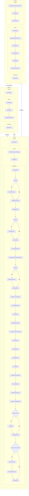

### Engine States

```mermaid
graph TD;
    subgraph MainMenu
        subgraph MainMenuHandleInput[HandleInput]
            MainMenuInputSystemHandleInput[InputSystem]
        end
        
        subgraph MainMenuUpdate[Update]
            MainMenuNUIManagerUpdate[NUIManager] --> MainMenuEventSystemUpdate[EventSystem]
            MainMenuEventSystemUpdate --> MainMenuStorageServiceWorkerUpdate[StorageServiceWorker]
        end
        
        subgraph MainMenuRender[Render]
            MainMenuNUIManagerRender[NUIManager]
        end
    end
    
    subgraph Loading
        subgraph LoadingUpdate[Update]
            LoadingLoadingScreenUpdate[LoadingScreen::updateStatus] --> LoadingNUIManagerUpdate[NUIManager]
            LoadingNUIManagerUpdate--> LoadingStepUpdate
            subgraph LoadingStepUpdate[Step Update]
                direction TB
                RegisterMods --> InitRenderingHeadlessCheck{!headless}
                InitRenderingHeadlessCheck -->|true| InitialiseRendering --> InitialiseEntitySystem
                InitRenderingHeadlessCheck -->|false| InitialiseEntitySystem
                InitialiseEntitySystem --> RegisterBlocks --> InitGraphicsHeadlessCheck{!headless}
                InitGraphicsHeadlessCheck -->|true| InitialiseGraphics --> LoadPrefabs
                InitGraphicsHeadlessCheck -->|false| LoadPrefabs
                LoadPrefabs --> ProcessBlockPrefabs
                ProcessBlockPrefabs --> InitialiseComponentSystemManager --> InitInputHeadlessCheck{!headless}
                InitInputHeadlessCheck -->|true| RegisterInputSystem --> RegisterSystems
                InitInputHeadlessCheck -->|false| RegisterSystems
                RegisterSystems --> InitialiseCommandSystem --> LoadExtraBlockData --> InitialiseWorld
                InitialiseWorld --> RegisterBlockFamilies --> EnsureSaveGameConsistency
                EnsureSaveGameConsistency --> InitialisePhysics --> InitialiseSystems --> PreBeginSystems
                PreBeginSystems --> LoadEntities --> InitialiseBlockTypeEntities --> CreateWorldEntity
                CreateWorldEntity --> InitialiseWorldGenerator --> InitialiseRecordAndReplay
                InitialiseRecordAndReplay --> NetModeIsServerCheck{netMode.isServer}
                NetModeIsServerCheck -->|true| StartServer --> PostBeginSystems
                NetModeIsServerCheck -->|false| PostBeginSystems
                PostBeginSystems --> NetModeHasLocalClientCheck{netMode.hasLocalClient}
                NetModeHasLocalClientCheck -->|true| SetupLocalPlayer --> AwaitCharacterSpawn --> PrepareWorld
                NetModeHasLocalClientCheck -->|false| PrepareWorld
                PrepareWorld
            end
        end

        subgraph LoadingRender[Render]
            LoadingNUIManagerRender[NUIManager]
        end
    end
    
    subgraph InGame
        subgraph InGameHandleInput[HandleInput]
            InGameHandleInputInputSystem[InputSystem]
        end

        subgraph InGameUpdate[Update]
            InGameEventSystemUpdate[EventSystem] --> InGameComponentSystemsUpdate[UpdateSubscriberSystems]
            InGameComponentSystemsUpdate --> InGameWorldRendererUpdate[WorldRenderer]
            InGameWorldRendererUpdate --> InGameStorageManagerUpdate[StorageManager]
            InGameStorageManagerUpdate --> InGameNUIManagerUpdate[NUIManager]
            InGameNUIManagerUpdate --> InStorageServiceWorkerUpdate[StorageServiceWorker]
        end

        subgraph InGameRender[Render]
            InGameDisplayDevicePrepareToRender[DisplayDevice::prepareToRender] --> InGameNUIManagerRender[NUIManager]
            InGameNUIManagerRender--> InGameWorldRendererrRender[WorldRenderer]
        end
    end
    
    MainMenu -->|Start Game| Loading
    Loading -->|Failed| MainMenu
    Loading -->|Succeeded| InGame
    InGame -->|Exit To Main Menu| MainMenu
```
