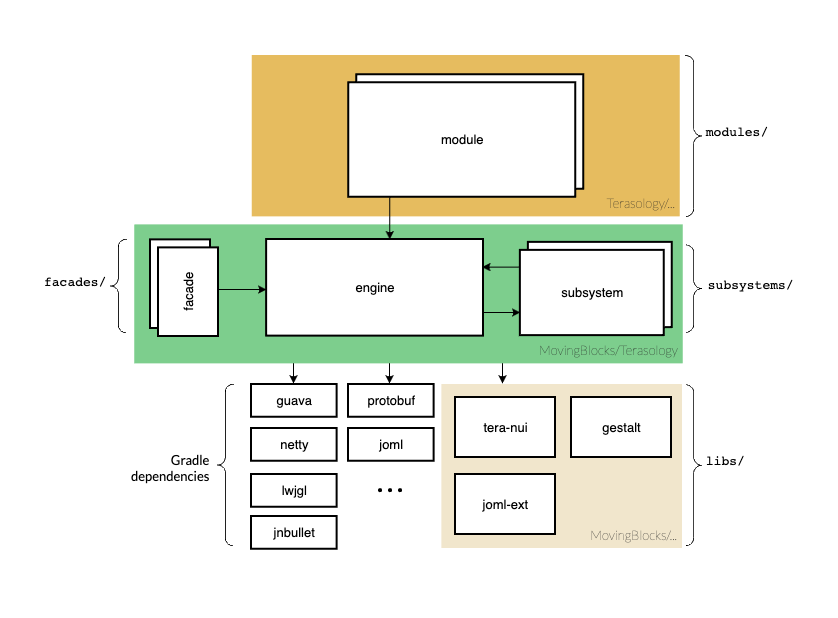

  

# Welcome to Terasology!

🌟 **Embark on an open-source adventure** where you can contribute, play, and explore the world of Terasology.

Whether you're here to join the community, contribute to the project, or just learn more about the game, we've got you covered.

## Understanding Terasology

Terasology is a mosaic of many components, beautifully combined to create a sandbox for your imagination.

- 🏛️ **[Architecture Overview](Codebase-Structure.md)**
  - Understand the high-level structure of the project.
- 🔧 **[Entity System Architecture](Entity-System-Architecture.md)**
  - Dive into how our entity system powers the game.
- 🎲 **[Events and Systems](Events-and-Systems.md)**
  - Explore how to inject new logic and life into the game.
- 🏗️ **[Block Architecture](https://github.com/Terasology/TutorialAssetSystem/wiki/Block-Attributes)**
  - Delve into the building blocks of the game world.

## Quick Links

- **[🎮 Start Playing](https://github.com/MovingBlocks/Terasology/blob/develop/docs/Playing.md)**
- **[🏗️ Developer's Hub](Contributor-Quick-Start.md)**
- **[🛠️ Troubleshooting](Troubleshooting.md)**
- **[🛠️ Maintainer's Dashboard](Maintenance.md)**

## Community and Support

Join the discussions, seek support, and contribute to the community.

- 👋 [Discord Server](https://discord.gg/terasology) - For live discussions and support.
- 📚 [Forum](https://forum.terasology.org/forum/) - For project updates and inspiration.

### Getting Help

- For gameplay questions: Use the `#play-terasology` channel on Discord.
- For development support: Post in the `#terasology` channel or [open an issue on GitHub](https://github.com/MovingBlocks/Terasology/issues/new/choose).

## Getting Started as a Contributor

🚀 Ready to dive into development? Check out the [Contributor Quick Start](Contributor-Quick-Start.md) guide to set up your workspace, understand the required tools, and make your first contribution.

- Get familiar with [Git and GitHub basics](https://docs.github.com/en/get-started/quickstart/hello-world) for collaborating on code.
- Set up your Terasology Development Workspace and start playing around with the code.

## Troubleshooting

Encountering issues? Our [Troubleshooting guide](Troubleshooting.md) offers solutions for common problems faced by players and developers alike.

- Find quick fixes and helpful resources for common issues.
- Get additional support by reaching out on [Discord](http://discord.gg/Terasology) or our [Support Forum](http://forum.terasology.org/forum/support.20).

## Stay Updated & Reach Out

📢 We love sharing updates and hearing from you!

- **[Discord](https://discordapp.com/invite/terasology)** - For `#announcements` and direct Q&A.
- **[GitHub (Engine)](https://github.com/MovingBlocks/Terasology)** - Watch the engine or modules for real-time updates.
- **[GitHub (Modules)](https://github.com/Terasology)** - Watch the module repos for game content fixes / changes.
- **[Forum](http://forum.terasology.org/)** - Find the progress reports of ongoing and past GSoC projects
- **[Twitter](http://twitter.com/#!/Terasology)** - Follow for tweet-sized news.
- **[Facebook](http://www.facebook.com/pages/Terasology/248329655219905)** - Like us for updates in your feed.
- **[Jenkins RSS](http://jenkins.terasology.org/rssAll)** - For the keen observers of new builds.