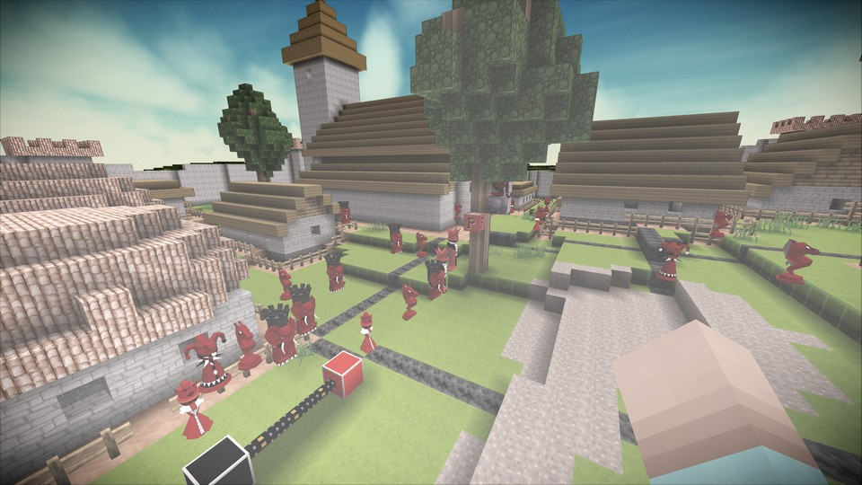

# Modules

Content, gameplay mechanics, and mostly everything other than the engine that allows the game to run is stored in what we call "modules" which are _similar_ to the traditional meaning of "mods" but intended to be smaller building blocks you'd normally put several of together to make one traditional "mod".

Modules in turn are sometimes grouped in "Gameplay Templates" which are like Minecraft-style mod packs. These are directly available via drop-down at world creation and are the suggested way to enable more content. Do **not** enable every single module manually! :-) 

You can customize module selection with the "Modules" button but you generally should enable very few or rely on the gameplay templates. Some world generator types may be registered by a module and auto-select that and maybe other modules if you choose that world type. Modules may also enable additional console commands (listed by the "help" command when active).

The game can download module updates from our central meta-server and clients connecting to a game server will be automatically sent the right version of any enabled modules! 

Be cautious in downloading modules beyond the ones shipped with the ["Omega Zip"](https://github.com/MovingBlocks/Terasology/releases) - other modules not bundled with the game are likely still in development or unstable and may crash the game.

Module source repositories live under the [Terasology organization](https://github.com/Terasology) on GitHub, while the engine level projects live under the [MovingBlocks organization](https://github.com/MovingBlocks).

Here's a list of modules bundled with the game by default (this line-up will change now and then). It should roughly match this category in Jenkins: http://jenkins.terasology.org/view/Modules and you can download updated modules from there if needed.

* [AlterationEffects](https://github.com/Terasology/AlterationEffects) - module for storing some buff/debuff type effects
* [AnotherWorld](https://github.com/Terasology/AnotherWorld) - world gen module, includes features like ore placement and caves, used by WoodAndStone's world
* [AnotherWorldPlants](https://github.com/Terasology/AnotherWorldPlants) - farming and tree growth for AnotherWorld
* [BlockNetwork](https://github.com/Terasology/BlockNetwork) - a framework to support blocks that can communicate with each other in some fashion
* [BlockPicker](https://github.com/Terasology/BlockPicker) - allows the player access to an infinite block inventory with the `B` key
* [Breathing](https://github.com/Terasology/Breathing) - without this you can't breathe! But you also don't need to. Enable it to drown properly in water (or not!)
* BuilderSampleGameplay - gameplay front for engine alone to show lack of inventory and health can work
* [CakeLie](https://github.com/Terasology/CakeLie) - the cake may be a lie, but these cake and candy blocks are delicious!
* [Caves](https://github.com/Terasology/Caves) - a cave generation module (actually an ore vein generator placing air veins!) based on CustomOreGen
* [ChangingBlocks](https://github.com/Terasology/ChangingBlocks) - allows blocks to change over time (such as switching to a more dusty / worn looking block after x amount of days)
* [CheatsForAll](https://github.com/Terasology/CheatsForAll) - if enabled on a server allows the use of `cheat` commands for any player connected without any additional admin setup
* [ChrisVolume1OST](https://github.com/Terasology/ChrisVolume1OST) - official game soundtrack by Chris Köbke - volume 1
* [ChrisVolume2OST](https://github.com/Terasology/ChrisVolume2OST) - official game soundtrack by Chris Köbke - volume 2
* [Cities](https://github.com/Terasology/Cities) - procedural city placer and plot organizer, also places roads to connect cities
* [ClimateConditions](https://github.com/Terasology/ClimateConditions) - A library module for managing temperature, humidity, and other climate factors 
* [CommonWorld](https://github.com/Terasology/CommonWorld) - general world generation utility module
* [ComputerMonitors](https://github.com/Terasology/ComputerMonitors) - allows for the creation of functional multi-block monitors in-game - ModularComputers puts them to work!
* [CopperAndBronze](https://github.com/Terasology/CopperAndBronze) - another era for throughout the ages, this time copper and bronze (comes after wood and stone)
* Core - mandatory content needed for normal game launch
* CoreSampleGameplay - gameplay front for Core - allows modules to depend on Core without the default starting inventory
* [CustomOreGen](https://github.com/Terasology/CustomOreGen) - library containing an ore distribution algorithm based on [JRoush's CustomOreGen](http://www.minecraftforum.net/forums/mapping-and-modding/minecraft-mods/1282294-1-4-6-v2-custom-ore-generation-updated-jan-5th)
* [DamagingBlocks](https://github.com/Terasology/DamagingBlocks) - allows blocks like lava to hurt the player
* [Durability](https://github.com/Terasology/Durability) - library module to support destructible items (wear and tear eventually breaks them)
* [EventualSkills](https://github.com/Terasology/EventualSkills) - a time-based skill system, a bit akin to EVE Online's system
* [Fences](https://github.com/Terasology/Fences) - fences!
* [Fluid](https://github.com/Terasology/Fluid) - adds support for fluid in non-world situations (such as for storage in workstations)
* [FluidComputerIntegration](https://github.com/Terasology/FluidComputerIntegration) - allows for interactions with fluids via computers
* [FunnyBlocks](https://github.com/Terasology/FunnyBlocks) - cheese wheels and bowling pins - why not
* [Genome](https://github.com/Terasology/Genome) - genetics WOO! Complete with DNA letters and mutating plants. Part of the Wood & Stone line-up
* [GooeysQuests](https://github.com/Terasology/GooeysQuests) - spawn our mascot Gooey (console: `spawnPrefab gooey`) then `e` click to interact for commands and quests!
* [GrowingFlora](https://github.com/Terasology/GrowingFlora) - organically growing (step by step) trees and such
* [Hunger](https://github.com/Terasology/Hunger) - makes the player slowly gets hungry (needs actual GUI work and ways to then actually eat food though). Console `hungerCheck` for stats
* [InGameHelp](https://github.com/Terasology/InGameHelp) - system for showing help in-game, default key `P`
* [IRLCorp](https://github.com/Terasology/IRLCorp) - Industrialized Reduction of Labor Corporation - Helping workmen everywhere
* [ItemRendering](https://github.com/Terasology/ItemRendering) - a library for displaying "holographic" items in the world
* [JoshariasSurvival](https://github.com/Terasology/JoshariasSurvival) - formerly known as TerraTech - gameplay template for a machine-centric survival style
* [Journal](https://github.com/Terasology/Journal) - allows the player to use an in-game journal for gameplay notifications and such. Default toggle key 'J'
* ~~[LandOfTerra](https://github.com/Terasology/LandOfTerra) - contains a set of unusual world generators~~ (being refactored)
* [LegacyMusic](https://github.com/Terasology/LegacyMusic) - older music pieces predating the official soundtrack
* [LightAndShadow](https://github.com/Terasology/LightAndShadow) - main module for the Light & Shadow gameplay
* [LightAndShadowResources](https://github.com/Terasology/LightAndShadowResources) - IMMA FIRIN’ MAH LASR!! Art assets for the Light & Shadow concept
* [Machines](https://github.com/Terasology/Machines) - machine infrastructure library module
* [Malicious](https://github.com/Terasology/Malicious) - a series of module security tests to check that modules cannot do naughty things when running
* [ManualLabor](https://github.com/Terasology/ManualLabor) - tools and logic for manual labor (digging, chopping, etc)
* [ManualLaborEventualSkills](https://github.com/Terasology/ManualLaborEventualSkills) - bridge module for adding EventualSkills to ManualLabor
* [MarcinScIncubator](https://github.com/Terasology/MarcinScIncubator) - parking lot for tools used in @MarcinSc's many modules without a more explicit home yet
* [MarkovChains](https://github.com/Terasology/MarkovChains) - Library module with some pseudo random math stuff
* [MasterOfOreon](https://github.com/Terasology/MasterOfOreon) - Master the Oreons, or others like them, from the throne-world of the Ancients! A menu command system, default show/hide key 'O'
* [Maze](https://github.com/Terasology/Maze) - a maze generator. Right-click with the provided maze tool on one block then again on another and a maze will generate between the two points (in multiple layers if the area is tall enough)
* [Minerals](https://github.com/Terasology/Minerals) - a large collection of mineral blocks
* [Miniion](https://github.com/Terasology/Miniion) - base creature control system, used by MasterOfOreon - old module that has gone through a few redesigns
* [Minimap](https://github.com/Terasology/Minimap) - a basic minimap. Show/hide with `M` by default and zoom with numpad `-` and `+`
* [MobileBlocks](https://github.com/Terasology/MobileBlocks) - supports blocks that can move their location based on some directions
* [ModularComputers](https://github.com/Terasology/ModularComputers) - central module for the creation of computers that themselves can have "hardware modules" of sorts added to them in-game to add interesting functionality
* [MoreLights](https://github.com/Terasology/MoreLights) - assorted illuminated blocks
* [MultiBlock](https://github.com/Terasology/MultiBlock) - supports the concept of multiple blocks being part of the same structure
* [MusicDirector](https://github.com/Terasology/MusicDirector) - allows music assets to be prepared for dynamic inclusion in appropriate contexts (like time of day)
* [NameGenerator](https://github.com/Terasology/NameGenerator) - can create random themed names for use by other modules, or via console using commands like `generateNameList 10`
* [OreGeneration](https://github.com/Terasology/OreGeneration) - ore generation plugin system based on CustomOreGen (this one enables easy definition of what ores you want in a world)
* [Oreons](https://github.com/Terasology/Oreons) - little sentient cookie people! Don't do much yet. Place with `spawnPrefab OreonGuard` in the console (other types exist)
* [Pathfinding](https://github.com/Terasology/Pathfinding) - framework for pathfinding used by other modules
* [PlantPack](https://github.com/Terasology/PlantPack) - more plants! Used by the Throughout the Ages gameplay
* [PolyWorld](https://github.com/Terasology/PolyWorld) - creates very neat island worlds based on the [map generating algorithm by Amit Patel of Red Blob Games](http://www-cs-students.stanford.edu/~amitp/game-programming/polygon-map-generation/)
* [Portals](https://github.com/Terasology/Portals) - allows placement of portal blocks that'll spawn Oreons `giveBlock portal`
* [QuestExamples](https://github.com/Terasology/QuestExamples) - samples for developers to help create quests
* ~~[Rails](https://github.com/Terasology/Rails) - railroads and trains! Press 'e' to start a caboose or enter a cart. Use the wrench to attach carts~~ (broken, waiting for author's return)
* [Sample](https://github.com/Terasology/Sample) - miscellaneous example content showcasing module usage
* [Seasons](https://github.com/Terasology/Seasons) - adds seasons to the game
* [Signalling](https://github.com/Terasology/Signalling) - circuitry implementation based on BlockNetwork, similar to redstone
* [SimpleFarming](https://github.com/Terasology/SimpleFarming) - easy to understand growing of foods
* [SimpleLiquids](https://github.com/Terasology/SimpleLiquids) - lets water propagate in the world - beware of floods!
* [Soils](https://github.com/Terasology/Soils) - a small pack of different soil types
* [Spawning](https://github.com/Terasology/Spawning) - split out from Portals to serve as general utility for anything needing stuff to spawn
* [StructuralResources](https://github.com/Terasology/StructuralResources) - a set of structural shapes suitable for buildings and such
* [SubstanceMatters](https://github.com/Terasology/SubstanceMatters) - library for the definition and usage of materials in various contexts, such as tools with dynamic looks based on material
* [Tasks](https://github.com/Terasology/Tasks) - allows for the definition of tasks/quests
* [ThroughoutTheAges](https://github.com/Terasology/ThroughoutTheAges) - gameplay module for a large content series letting you slowly climb a tech tree to improve your available tools, foods, and so on
* [TutorialWorldGeneration](https://github.com/Terasology/TutorialWorldGeneration) - a world generation tutorial module, goes with a guide in its [wiki](https://github.com/Terasology/TutorialWorldGeneration/wiki)
* [Valentines](https://github.com/Terasology/Valentines) - What is love? Gooey don't hurt me, don't hurt me, no more ... ♫
* [WildAnimals](https://github.com/Terasology/WildAnimals) - a module containing animals, initially a deer you can spawn in-world via console with `spawnPrefab deer` then watch wander idly
* [WoodAndStone](https://github.com/Terasology/WoodAndStone) - big content module including "from scratch" crafting, starting with wood here
* [Workstation](https://github.com/Terasology/Workstation) - workstations offer a way to use blocks in-world for advanced purposes
* [WorkstationInGameHelp](https://github.com/Terasology/WorkstationInGameHelp) - bridging module to bring in-game help to workstation screens
* [WorldlyTooltip](https://github.com/Terasology/WorldlyTooltip) - a little tooltip that shows you what you're looking at (hold `alt` for debug details)

Some of the modules in action:

