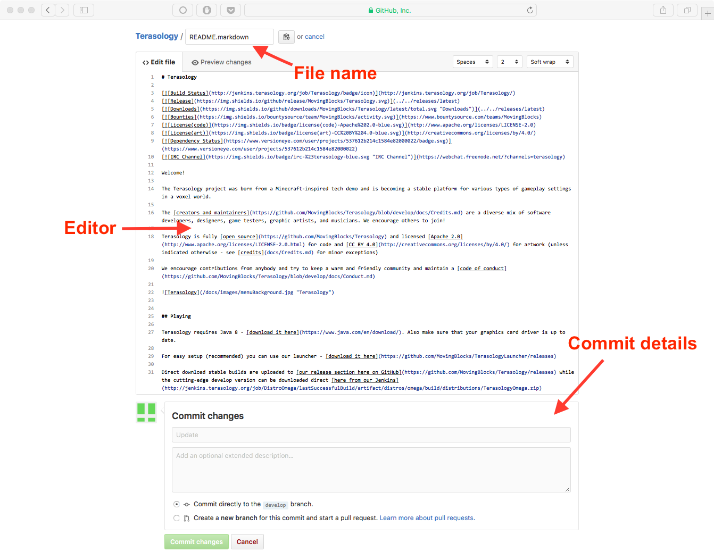

# Introduction
Every day, bit by bit, Terasology is growing. From the smallest of jobs like adding readmes to slightly larger jobs like adding code, people from all around the world wish to contribute to the project. However, for many the process is far more complex than required. For instance, one doesn't need to clone a complete Git-linked repository to one's system just to edit a readme. This guide will guide you through setting up a light environment so that you can do these relatively small tasks without much tedium.

# Using the GitHub Web Interface
GitHub's web interface is great for tasks involving small edits to code or edits to text files (like readmes) or wikis. It allows the user to edit and commit right from the browser window.

## When *not* to use the web interface

Before detailing how to use the web approach it is worth highlighting when **not** to use it, as we often see the web interface used for work that really needs a [full engine workspace](https://github.com/MovingBlocks/Terasology/wiki/Preparing-an-Engine-Workspace) - anything that results in a testable change in the game (or other _compiled_ bits of code and resources) should really be done in an [IDE](https://en.wikipedia.org/wiki/Integrated_development_environment) to take advantage of the tooling to build and [analyze](https://github.com/MovingBlocks/Terasology/wiki/Checkstyle) your changes. This makes sure your changes follow the [project code style](https://github.com/MovingBlocks/Terasology/wiki/Common-Style-Points) and other guidelines, and lets you run the game to test that your work actually achieves your objective. That way you can also verify that you have good testing instructions to place in a Pull Request (PR), take screenshots if appropriate, and so on.

Making a change using the web UI bypasses most such checks - syntax, style, code smells, testing, and so on. So it remains best to limit use of the web UI to editing documentation and making simple fixes like typos. You are of course free to do what you wish in a fork, especially if perhaps you are sharing it with a few friends, but don't be surprised if the quality standards for having a PR merged runs into the web-based workflow as a negative for changes outside the simple ones this workflow does well :-)

In some cases there may be a hybrid approach: using a full Web IDE such as https://www.gitpod.io so you can test your changes without a local workspace. This works for instance for [Destination Sol](https://github.com/MovingBlocks/DestinationSol) as it is less demanding for 3D graphics, but not so well for Terasology (the game runs, but lags intensely)

## Creating a Fork
To create a fork of Terasology, visit [Terasology's GitHub repository](https://github.com/MovingBlocks/Terasology) and click the "Fork" button near the top right corner of the screen. This will create a fork of the repository in your GitHub account.

## Creating and Deleting Branches
Since you are going to be making changes, it might be a good idea to create a branch before. You can create a branch by clicking on the repository's branch selector and typing in the name of the branch. If the branch doesn't exist, GitHub will offer to create it for you.

You can go to the *Branches* page of your repository by clicking on the number of branches displayed on the home page of the repository. This will take you to an overview of all your branches. From here, you can delete branches by clicking the little red trash can icons.

## Editing
### Creating a File
1. Navigate to the main page of your repository.
2. Browse to the folder where you want to create a file.
3. Click the *Create new file* button above the file list.
4. Type the name and extension of the file you want to create in the name field. You may also create subdirectories here by using the `/` directory separator.
5. Add contents to the file in the *Edit new file* tab. You may preview your file while editing using the *Preview* tab.
6. At the bottom of the page, type a commit message, choose the branch you want to commit to, and then click the *Commit New File* button.

### Editing, Renaming or Moving Files
1. Browse to the file you want to make changes to.
2. In the upper right hand corner, click the little pencil icon to open the editor.
3. You can change the name of the file at the top of the page. You can also move the file by using the `/` separator to make/access subdirectories (use `..` to go to the parent directory).
4. Make the changes you want to make in the *Edit* tab. You may preview the changes using the *Preview* tab.
5. Scroll to the bottom of the page, type a commit message, choose the branch you want to commit to, and click the *Commit Changes* button.

### Deleting files
1. Browse to the file you want to delete.
2. At the top of the file, click the little trashcan icon.
3. Scroll to the bottom of the page, type a commit message, choose a branch, and commit.

## Opening a Pull Request
1. Navigate to the home page of your repository.
2. Press the *Pull Request* button at the top of the page.
3. Give a title and description to the pull request.
4. Press the *Create a pull request* button.

# Using the GitHub Desktop Client
For many changes, especially more elaborate ones, you may prefer downloading the repository on your system, making changes, testing them and then committing them. This can be achieved by various means, the most popular of which is git's command-line interface. However, this may be daunting for many users, especially beginners. This is where GitHub's desktop client comes in. The GitHub desktop client is an easy way to clone and edit repositories on your system. Here are a few tips to help you get started.

Note that to access your environment via the desktop client, you first need to fork the [Terasology repository](https://github.com/MovingBlocks/Terasology) using the process mentioned before in this document.

## Setting Up the Client
The GitHub desktop client can be downloaded from [the GitHub desktop home page](https://desktop.github.com). The client is available for MacOS and for Windows. Sadly, there is no Linux client yet.  
On launching the client for the first time, you will be asked to enter your GitHub account username and password, after which you will be led through a short tutorial on the basics of using the client.

## Cloning Your Repository
1. Launch the client.
2. Press the `+` dropdown in the top left corner.
3. Go to the *Clone* tab.
4. Select the name of the forked repository from the list of all your repositories.

## Creating a Branch
1. Click on the create branch icon.
2. Type in a name and select the original branch from which to branch off.
3. Press the *Create Branch* button.

## Making Changes and Committing
Sadly, the desktop client doesn't support making changes or browsing the repo. You will need to browse the repo and make changes using the operating system's file explorer and appropriate editing tools on your system. To commit, simply select the repository in the tray on the left hand side, select which files to commit, type a commit message and description and press the *Commit* button. You can push committed changes by pressing Control+P (Cmd+P on Mac) or by using the *Publish* button at the top right corner of the screen. You can also use the toolbar item at Repository -> Push.

## Opening Pull Requests
1. Select your repository in the tray at the left.
2. Press the *Pull Request* button in the top right corner.
3. Provide a title and description.
4. Press *Send Pull Request*.

